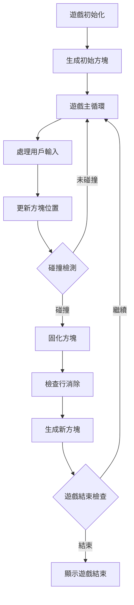

# 遊戲專案改進計劃

## 專案現狀分析

### 現有組件
1. **Snake Game** (`snake.html`) - 功能完整的貪食蛇遊戲
   - 支援鍵盤與觸控操作
   - 分數記錄與本地存儲
   - 暫停/繼續功能
   - 響應式設計（基本）

2. **遊戲中心首頁** (`stitch_gg_game_center_homepage/code.html`) - 復古風格遊戲中心
   - Tailwind CSS 設計
   - 遊戲卡片展示（Snakey, Blockblast）
   - 響應式佈局
   - 視覺效果良好

3. **俄羅斯方塊 PRD** (`PRD.md`) - 需求規格說明
   - 需要修復方塊生成邏輯錯誤
   - 需要添加移動端虛擬控制器
   - 遊戲流程中斷問題

4. **UI 設計規範** (`UI-PRD.txt`) - 遊戲中心設計要求
   - 復古紅白機風格
   - 主色調: #ebeac6 + #A50000
   - 兩個遊戲: Snakey 和 Blockblast

### 主要問題
1. **缺失的俄羅斯方塊遊戲** - PRD 中描述但未實現或存在嚴重錯誤
2. **遊戲中心與實際遊戲未連接** - 首頁按鈕無功能
3. **專案結構分散** - 文件組織混亂
4. **移動端優化不足** - 特別是俄羅斯方塊遊戲
5. **代碼組織** - 所有代碼在單一 HTML 文件中

## 改進建議

### 高優先級（核心功能修復）

#### 1. 創建/修復俄羅斯方塊遊戲
**目標**: 實現 PRD 中描述的功能完整的俄羅斯方塊遊戲

**具體任務**:
- 創建 `block.html` 或 `tetris.html` 遊戲文件
- 實現核心遊戲邏輯：
  - 7 種經典方塊形狀 (I, J, L, O, S, T, Z)
  - 方塊旋轉與移動
  - 行消除與得分計算
- 修復 PRD 中提到的問題：
  - 方塊落地後自動生成新方塊
  - 實現預覽區顯示下一個方塊
- 添加移動端虛擬控制器：
  - 左/右移動按鈕
  - 旋轉按鈕
  - 加速下落按鈕
  - 即時落下按鈕
- 添加遊戲狀態管理：
  - 開始/暫停/繼續/重新開始
  - 分數與等級系統
  - 本地存儲最高分

#### 2. 遊戲中心整合
**目標**: 將所有遊戲連接到統一的遊戲中心

**具體任務**:
- 修改遊戲中心首頁的 "Play Now" 按鈕，使其連結到實際遊戲
- 為 Snakey 卡片連結到 `snake.html`
- 為 Blockblast 卡片連結到新的俄羅斯方塊遊戲
- 創建統一的導航系統
- 添加返回遊戲中心的按鈕到各個遊戲頁面

### 中優先級（體驗優化）

#### 3. 貪食蛇遊戲改進
**目標**: 提升遊戲體驗與現代化功能

**具體任務**:
- **響應式改進**:
  - 動態調整畫布大小適應不同屏幕
  - 改進虛擬方向鍵佈局
- **遊戲功能增強**:
  - 添加音效（吃食物、遊戲結束等）
  - 添加視覺反饋（食物閃爍、蛇身特效）
  - 添加遊戲難度選擇（慢速、正常、快速）
  - 添加遊戲說明/教程畫面
- **代碼重構**:
  - 分離 CSS 到外部文件
  - 分離 JavaScript 到外部文件
  - 模塊化遊戲邏輯

#### 4. 俄羅斯方塊遊戲優化
**目標**: 確保良好的移動端體驗

**具體任務**:
- 觸控事件優化（防止 300ms 延遲）
- 虛擬按鈕視覺反饋（按下狀態）
- 自適應佈局（平板與手機）
- 添加遊戲設置（初始速度、控制靈敏度）

### 低優先級（進階功能）

#### 5. 專案結構重組
**目標**: 創建清晰、可維護的專案結構

**具體任務**:
```
/games
  /snake
    index.html
    style.css
    game.js
    assets/
  /tetris
    index.html
    style.css
    game.js
    assets/
/game-center
  index.html
  style.css
/assets
  images/
  sounds/
/docs
  PRD.md
  UI-spec.md
```

#### 6. 附加功能
**目標**: 增加遊戲中心價值

**具體任務**:
- 添加玩家帳戶系統（可選）
- 添加全球排行榜
- 添加遊戲成就系統
- 添加社交分享功能

## 技術實施建議

### 俄羅斯方塊遊戲架構


### 移動端虛擬控制器設計
- **佈局**: 十字方向鍵 + 功能按鈕
- **事件處理**: `touchstart` + `touchend` 即時響應
- **視覺反饋**: 按鈕按下狀態變化
- **防止誤觸**: `user-select: none` + `touch-action: manipulation`

### 遊戲中心整合策略
1. 使用相對路徑連結遊戲
2. 每個遊戲頁面添加統一的導航欄
3. 遊戲狀態通過 URL 參數或 localStorage 傳遞
4. 一致的視覺風格（遵循 UI-PRD 規範）

## 實施路線圖

### 第一階段：核心修復（1-2天）
1. 創建基本的俄羅斯方塊遊戲框架
2. 修復方塊生成邏輯錯誤
3. 添加基本虛擬控制器
4. 連接遊戲中心按鈕

### 第二階段：體驗優化（2-3天）
1. 貪食蛇遊戲響應式改進
2. 俄羅斯方塊移動端優化
3. 添加基本音效與視覺效果
4. 統一遊戲風格

### 第三階段：結構重組（1-2天）
1. 重組專案文件結構
2. 分離 CSS/JS 文件
3. 創建統一的資源管理
4. 更新文檔

## 成功標準

### 功能測試
- [ ] 俄羅斯方塊遊戲可以連續進行（方塊落地後自動生成新方塊）
- [ ] 移動端虛擬控制器所有功能正常
- [ ] 遊戲中心可以導航到所有遊戲
- [ ] 貪食蛇遊戲在各種設備上正常運行

### 體驗測試
- [ ] 觸控操作無明顯延遲
- [ ] 遊戲畫面適應不同屏幕尺寸
- [ ] 遊戲有適當的視覺/聽覺反饋
- [ ] 用戶可以無障礙地在遊戲間切換

### 技術測試
- [ ] 代碼結構清晰，易於維護
- [ ] 無明顯性能問題
- [ ] 兼容主流瀏覽器（Chrome, Safari, Firefox）
- [ ] 移動端 Safari/Chrome 無滾動/縮放問題

## 下一步行動

1. **確認優先級**: 您希望首先處理哪個部分？
2. **資源評估**: 是否需要額外的圖形/音效資源？
3. **技術決策**: 對俄羅斯方塊遊戲的具體實現方式有無偏好？
4. **時間安排**: 希望何時完成核心修復？

請審閱此計劃並提供反饋，我可以根據您的意見調整後開始實施。