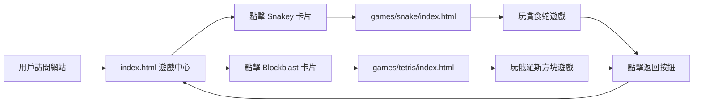

# UI 入口前端連接遊戲 - 實施計劃

## 目標
創建以遊戲中心 UI 為統一入口的前端系統，連接所有遊戲，提供無縫的遊戲體驗。

## 當前狀態分析
1. **現有資源**:
   - 遊戲中心首頁: `stitch_gg_game_center_homepage/code.html` (設計完整)
   - 貪食蛇遊戲: `snake.html` (功能完整)
   - 俄羅斯方塊 PRD: `PRD.md` (需求明確，遊戲缺失)
   - 空白的 `index.html` (應作為主入口)

2. **主要問題**:
   - 遊戲中心按鈕無實際功能
   - 遊戲文件分散在不同位置
   - 缺少統一的導航系統
   - 俄羅斯方塊遊戲尚未實現

## 實施方案

### 階段一：建立統一入口 (高優先級)

#### 1. 創建主入口文件 (`index.html`)
- 基於現有遊戲中心首頁 (`stitch_gg_game_center_homepage/code.html`)
- 調整為符合 UI-PRD.txt 的復古紅白機風格
- 設置為項目根目錄的主頁

#### 2. 遊戲卡片功能化
- **Snakey 卡片**: 連結到 `games/snake/index.html`
- **Blockblast 卡片**: 連結到 `games/tetris/index.html` (待創建)
- **Play Now 按鈕**: 實際跳轉到遊戲頁面
- **遊戲預覽**: 保持現有視覺效果

#### 3. 統一導航系統
- 所有遊戲頁面添加統一的導航欄
- 包含「返回遊戲中心」按鈕
- 一致的品牌標識 (GG Game Center)

### 階段二：遊戲連接與優化 (中優先級)

#### 1. 貪食蛇遊戲整合
- 移動 `snake.html` 到 `games/snake/index.html`
- 添加遊戲中心導航欄
- 優化移動端控制體驗
- 確保與遊戲中心風格一致

#### 2. 俄羅斯方塊遊戲創建
- 創建 `games/tetris/index.html`
- 實現 PRD.md 中的核心功能:
  - 連續方塊生成邏輯
  - 移動端虛擬控制器
  - 分數與等級系統
- 遵循遊戲中心視覺風格

#### 3. 響應式設計優化
- 確保所有頁面在手機、平板、桌面設備正常顯示
- 優化觸控操作體驗
- 測試不同瀏覽器兼容性

### 階段三：增強功能 (低優先級)

#### 1. 遊戲狀態管理
- 遊戲進度保存/讀取
- 統一的分數排行榜
- 遊戲設置持久化

#### 2. 用戶體驗提升
- 遊戲載入動畫
- 音效開關控制
- 遊戲說明/教程

#### 3. 擴展性設計
- 易於添加新遊戲的架構
- 統一的資源管理
- 模塊化代碼結構

## 技術架構

### 文件結構
```
/
├── index.html                    # 遊戲中心主入口
├── games/                        # 遊戲目錄
│   ├── snake/                    # 貪食蛇遊戲
│   │   ├── index.html
│   │   ├── style.css
│   │   ├── game.js
│   │   └── assets/
│   └── tetris/                   # 俄羅斯方塊遊戲
│       ├── index.html
│       ├── style.css
│       ├── game.js
│       └── assets/
├── assets/                       # 共享資源
│   ├── css/                      # 全局樣式
│   ├── js/                       # 全局腳本
│   └── images/                   # 共享圖片
└── plans/                        # 計劃文檔
```

### 導航流程


### 視覺風格規範
- **主色調**: #ebeac6 (米白) + #A50000 (深紅) - 根據 UI-PRD.txt
- **字體**: 復古遊戲機風格
- **按鈕**: 像素化設計，有按下狀態反饋
- **卡片**: 陰影與邊框增強遊戲感

## 實施步驟詳解

### 步驟 1: 創建主入口 (index.html)
1. 複製 `stitch_gg_game_center_homepage/code.html` 到 `index.html`
2. 調整顏色方案以匹配 UI-PRD.txt 規範
3. 修改遊戲卡片連結:
   - Snakey: `href="games/snake/index.html"`
   - Blockblast: `href="games/tetris/index.html"`
4. 更新頁面標題與元數據
5. 測試所有連結功能

### 步驟 2: 重組貪食蛇遊戲
1. 創建 `games/snake/` 目錄
2. 移動並重命名 `snake.html` 到 `games/snake/index.html`
3. 添加遊戲中心導航欄到遊戲頁面
4. 分離 CSS/JS 到外部文件
5. 測試遊戲功能與導航

### 步驟 3: 創建俄羅斯方塊遊戲
1. 創建 `games/tetris/` 目錄
2. 實現基本遊戲框架 (HTML/CSS/JS)
3. 實現核心遊戲邏輯:
   - 方塊生成與移動
   - 碰撞檢測
   - 行消除與計分
4. 添加移動端虛擬控制器
5. 添加遊戲中心導航欄
6. 測試遊戲功能

### 步驟 4: 響應式優化
1. 測試所有頁面在不同設備上的顯示
2. 調整佈局與字體大小
3. 優化觸控操作區域
4. 修復發現的顯示問題

### 步驟 5: 功能測試
1. 測試遊戲中心到遊戲的導航
2. 測試遊戲內返回功能
3. 測試遊戲功能完整性
4. 測試移動端操作體驗

## 成功標準

### 功能完整性
- [ ] 遊戲中心主頁正常顯示
- [ ] Snakey 卡片正確連結到貪食蛇遊戲
- [ ] Blockblast 卡片正確連結到俄羅斯方塊遊戲
- [ ] 所有遊戲頁面有返回遊戲中心的按鈕
- [ ] 貪食蛇遊戲功能完整
- [ ] 俄羅斯方塊遊戲功能完整 (根據 PRD)

### 用戶體驗
- [ ] 頁面載入時間合理
- [ ] 移動端操作流暢
- [ ] 視覺風格統一
- [ ] 導航直觀易懂

### 技術質量
- [ ] 代碼結構清晰
- [ ] 無明顯性能問題
- [ ] 兼容主流瀏覽器
- [ ] 響應式設計正常

## 時間估計
- **步驟 1**: 1-2 小時
- **步驟 2**: 2-3 小時
- **步驟 3**: 4-6 小時 (取決於俄羅斯方塊複雜度)
- **步驟 4**: 1-2 小時
- **步驟 5**: 1-2 小時

**總計**: 9-15 小時

## 下一步行動

請確認此計劃是否符合您的期望，特別是:
1. 文件結構安排是否合適？
2. 視覺風格是否需要調整？
3. 俄羅斯方塊遊戲的功能範圍是否正確？
4. 是否需要其他遊戲或功能？

確認後可切換到 Code 模式開始實施。